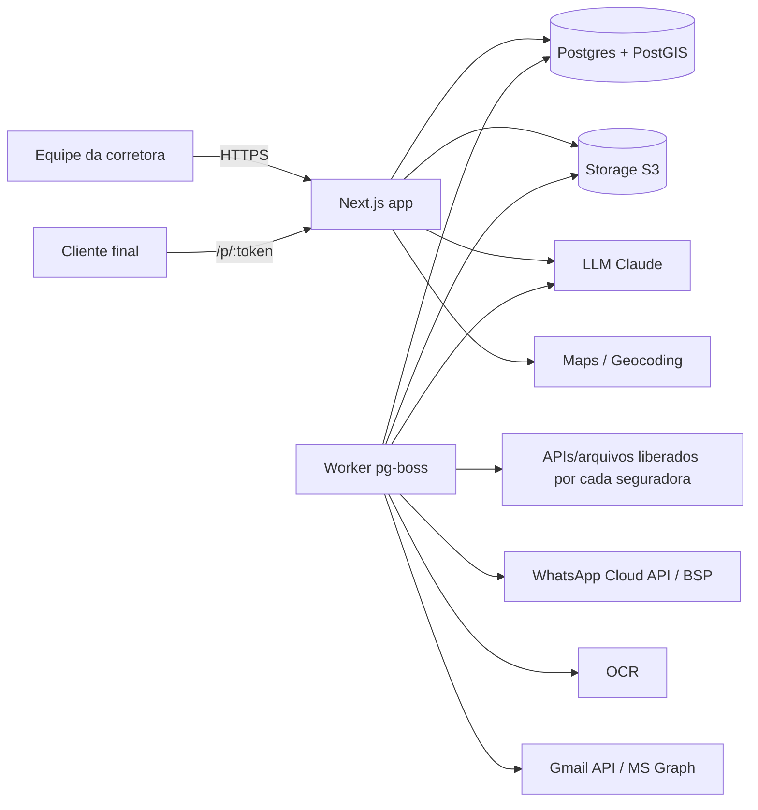

# Arquitetura

Decisões em formato ADR curto (Contexto → Decisão → Consequências). Duas arquiteturas convivem e são descritas separadamente: a **DEMO (Fase 0)**, que roda hoje, e a **arquitetura-alvo (Fase 1-real em diante)**.

---

## 0. Arquitetura da DEMO (Fase 0) — descrição honesta

| Aspecto | Como é na DEMO | Como será em produção |
|---|---|---|
| Dados | Store client-side (React context) semeado com dados **fictícios determinísticos**, todos com `demo: true` | Postgres + Prisma no servidor |
| Persistência | `localStorage` do navegador (por navegador/dispositivo; "Restaurar dados de demonstração" recria o seed) | Banco gerenciado com backup |
| Acesso a dados | Funções no estilo repositório (`listPolicies`, `upsertPerson`…) sobre o store | Mesma interface, implementação server-side (Server Actions / route handlers + Prisma) |
| Login | Seletor de usuário/papel (`/login`), **sem autenticação real** | Auth.js v5 + sessões em banco + 2FA |
| RBAC | Aplicado na UI a partir de `Settings.rolePermissions` (demonstra a experiência, não é segurança) | Aplicado no servidor em toda leitura/escrita |
| Integrações | Simuladores determinísticos rotulados "DEMO" (multicálculo, envio WhatsApp via `wa.me`, geocodificação por base local) | Adapters reais por contrato/API |
| IA | Motor de intenções determinístico em português usando as mesmas ferramentas; Document AI por regex/heurística em documentos de texto | Tool-calling com LLM (Claude por padrão) + OCR |
| Mapas | Leaflet + tiles OpenStreetMap | Adapter: Google Maps ou Mapbox (geocodificação com cache) |
| Marcas | Catálogo com os **nomes reais** das principais seguradoras/operadoras (decisão do cliente), mas planos, preços, redes e cotações **simulados** e sinalizados como tal; hospitais e clientes fictícios | Dados reais vindos das integrações próprias e importações |
| Sinalização | Badge/banner **"DEMO"** permanente (cor `demo`, fúcsia) | Sem badge |

**Regra:** a DEMO nunca deve receber dados reais de clientes (o `localStorage` não é cifrado nem auditado). Ver [SECURITY_LGPD](SECURITY_LGPD.md).

**Por que assim:** permite validar fluxos com a equipe da corretora sem infraestrutura, contratos ou risco LGPD, e o código de domínio (regras, comparadores, priorização, intent engine) é o mesmo que irá para produção — só a camada de repositório muda.

---

## ADR-01 — Monólito modular em Next.js 15 (App Router) + TypeScript

- **Contexto:** equipe pequena, domínio rico, necessidade de iterar rápido; poucas exigências de escala independente.
- **Decisão:** um único app Next.js 15 (App Router, React Server Components, Server Actions), TypeScript estrito. Módulos internos com fronteiras explícitas (pastas + imports controlados), não microsserviços.
- **Consequências:** deploy único, transações locais simples, refatoração barata. Jobs pesados (OCR, importação, multicálculo) rodam em worker separado do mesmo código (ADR-08). Extrair serviço só quando houver motivo medido.

## ADR-02 — Core + módulos de produto (registry)

- **Decisão:** `src/domain/products.ts` é o registry de ramos. **Hoje (DEMO)** cada `ProductModule` declara: `line`, `label`, `icon`, `color`, `depth` (`completo` | `basico`), `quoteFlow` (`saude` | `auto` | `generico`), `fields` (formulário genérico parametrizado), `requiredDocs`, `insuredSubject` e `renewalLeadDays`.
- **Evolução proposta (Fase 1-real+)**: completar o contrato com regras, comparadores e integrações, para que cada ramo declare tudo o que o diferencia:

```ts
interface ProductModule<Req = unknown> {
  // já existentes
  line: ProductLine; label: string; icon: string; color: string;
  depth: "completo" | "basico"; quoteFlow: "saude" | "auto" | "generico";
  fields: FieldSpec[]; requiredDocs: DocumentKind[]; insuredSubject: InsuredSubject; renewalLeadDays: number;
  // propostos
  requestSchema?: ZodSchema<Req>;      // valida Quote.request (JSONB) no servidor
  rules?: { validate(req: Req): Issue[]; recommend?(ctx): Recommendation; crossSell?: CrossSellRule[] };
  comparators?: ComparatorDimension[]; // dimensões do comparador / "O que muda?"
  integrations?: string[];             // ids de adapters habilitados para o ramo
  policySchema?: ZodSchema;            // valida Policy.lineData
}
```

- **Consequências:** adicionar um ramo = adicionar uma entrada no registry (e, se preciso, um fluxo dedicado em `src/modules/<ramo>` e adapters); o core (CRM, apólices, renovação, documentos, comissões) não muda. Ramos `basico` usam o formulário genérico a partir de `fields`.

## ADR-03 — Camadas

```
UI (app/, components/)            — React; sem regra de negócio
  ↓ chama
Application services (server/)    — casos de uso: createProposal, issuePolicy, runImport…; autorização, transação, auditoria
  ↓ usa
Domain (domain/)                  — puro, sem I/O: tipos, regras, priorização, comparadores, faixas ANS, dedupe
  ↓ persiste via
Repositories (repositories/)      — interface única; impl. DEMO (store/localStorage) e impl. Prisma
  ↓ e fala com o mundo via
Integrations (integrations/)      — adapters: insurers, health-networks, maps, whatsapp, email, ai, storage, document-parsing
```

Regras: domínio não importa nada de UI, repositório ou integração; testes unitários cobrem o domínio sem mocks de rede.

## ADR-04 — Estrutura de pastas

Estado atual (DEMO, em construção) + pastas previstas para a Fase 1-real (marcadas *futuro*):

```
especializada-os/
  docs/                      este planejamento
  prisma/schema.prisma       persistência real (design, não conectado à DEMO)
  src/
    app/                     rotas (App Router): /, /operacoes, /clientes/[id], /cotacoes/nova, /p/[id], /rede, /ai…
    components/ui/           design system
    domain/
      types.ts               modelo canônico
      products.ts            registry de ramos
      rbac.ts                papéis, permissões, escopo de carteira
      engines/               regras puras: priority, automation, crosssell, health, importer, metrics, queries, search, assistant
    data/seed.ts             seed determinístico de dados fictícios (demo: true)
    lib/                     utilitários puros: datas, formatação, geo (distância), texto (normalização, similaridade)
    integrations/            insurers/ (types, registry, adapters/demo-calculator), health-networks/, maps/, ai/, email/, storage/, document-parsing/ (whatsapp/ previsto)
    modules/                 *futuro* — fluxos dedicados por ramo quando crescerem
    server/                  *futuro* — application services (auth, transação, auditoria)
    repositories/            *futuro* — impl. Prisma com a mesma interface usada pela DEMO
    worker/                  *futuro* — processos pg-boss
  tests/                     node --test (domínio)
```

## ADR-05 — Postgres + Prisma

- **Decisão:** PostgreSQL 16 gerenciado (ex.: Neon, Supabase, RDS — a escolher) com Prisma ORM.
- **Por que Prisma e não Drizzle:** schema declarativo legível por não especialistas (serve como documentação do domínio), migrações maduras, tipagem gerada, adapter oficial do Auth.js. Drizzle é mais leve e próximo do SQL — ótimo, mas a vantagem é menor aqui do que a legibilidade do schema. Recursos que o Prisma não modela (PostGIS GIST, tsvector, RLS, REVOKE no audit_log) ficam em migrações SQL; consultas geo/fuzzy usam `$queryRaw` tipado dentro dos repositórios.
- **Consequências:** dependência do Prisma restrita à camada de repositórios (troca possível).

## ADR-06 — Autenticação: Auth.js v5

- **Decisão:** Auth.js v5 com `@auth/prisma-adapter`, **sessões em banco** (revogáveis), login por e-mail mágico e/ou Google/Microsoft (contas corporativas da corretora). **2FA TOTP obrigatório para admin e financeiro** (sessão só ganha `mfaVerified` após TOTP), opcional para os demais.
- **Alternativas:** Clerk/WorkOS (mais rápido, mas lock-in e dados de identidade fora); Lucia (descontinuado como lib). Revisar se SSO corporativo virar requisito forte.
- **Consequências:** cookies `HttpOnly; Secure; SameSite=Lax`, rotação de sessão no login, expiração por inatividade.

## ADR-07 — Autorização (RBAC) server-side

- Permissões (`Permission` em types.ts) por papel em `role_permissions`, editáveis por admin.
- Verificação em **todo** application service (`authorize(user, 'policies.edit', resource)`), nunca só na UI.
- Escopo de carteira: se `restrictWalletToOwner` e o usuário não tem `wallet.all`, filtros por `ownerId` são injetados no repositório.
- Campos sensíveis (CPF completo, dados de saúde, comissões) exigem permissão específica; revelar CPF registra `view_sensitive`.
- Defesa em profundidade futura: Row Level Security por `org_id`.

## ADR-08 — Jobs: pg-boss

- **Decisão:** fila sobre o próprio Postgres (pg-boss) para automações agendadas (janelas de renovação, follow-ups), importações, Document AI, multicálculo, envio de mensagens.
- **Por quê:** zero infraestrutura extra, transacional com os dados, retries/agendamento/cron nativos. **BullMQ/Redis** só se volume ou latência exigirem.
- Worker: mesmo repositório, processo separado (`node worker.js`).

## ADR-09 — Armazenamento de arquivos

- S3-compatível (AWS S3, Cloudflare R2 ou MinIO) atrás de `StorageAdapter`. Bucket privado; acesso apenas por **URLs assinadas de curta duração** (≤ 5 min) emitidas após checagem de permissão. SHA-256 para deduplicação; cifragem server-side; versionamento e lifecycle conforme retenção.

## ADR-10 — Busca

- Postgres: `pg_trgm` (similaridade/typos), `unaccent` (acentos), `tsvector` (texto), índices GIN.
- Interface `SearchProvider { search(query, scopes, user) }` — permite migrar para **Meilisearch/Typesense** se a busca global (⌘K) ficar lenta ou exigir relevância melhor, sem tocar na UI.
- Busca respeita RBAC (filtro aplicado antes do ranking).

## ADR-11 — Geo e mapas

- PostGIS (`geography(Point,4326)`, GIST) para "prestadores num raio", distância e ordenação.
- `MapsAdapter` com duas responsabilidades: **geocodificação** e **tiles**.
  - DEMO: Leaflet + tiles OpenStreetMap (respeitando a política de uso de tiles: atribuição, sem uso massivo) e coordenadas pré-calculadas no seed.
  - Produção: Google Maps Platform ou Mapbox para geocodificação, com **cache conforme os termos de cada provedor** (o Google, por exemplo, limita o cache de lat/lng a 30 dias — ver INTEGRATIONS); geocodificação feita uma vez por endereço/prestador, no backend.

## ADR-12 — PDF server-side

- A proposta é uma página HTML (`/p/[id]`). O PDF é gerado por **Chromium headless** (Playwright/Puppeteer, ou serviço gerenciado) renderizando a mesma página com CSS `@media print`. Uma fonte, duas saídas — nunca divergem.
- DEMO: o usuário usa "Imprimir → Salvar como PDF" do navegador.

## ADR-13 — Camada de LLM

- `LLMProvider` (complete, toolCall, extractStructured) com implementação Anthropic Claude por padrão; trocável por outro provedor ou modelo local.
- O LLM nunca acessa o banco diretamente: só via ferramentas tipadas que aplicam RBAC e retornam linhas + fonte. Ver [AI_ARCHITECTURE](AI_ARCHITECTURE.md).

## ADR-14 — Evitar vendor lock-in

| Dependência | Abstração | Alternativas |
|---|---|---|
| Banco | Repositórios + SQL padrão Postgres | Qualquer Postgres gerenciado |
| Storage | `StorageAdapter` (API S3) | S3, R2, MinIO |
| Mapas | `MapsAdapter` | Google, Mapbox, OSM/Nominatim próprio |
| LLM | `LLMProvider` | Claude (padrão), outros |
| OCR | `DocumentParser` | Textract, Google Document AI, Azure, Tesseract |
| WhatsApp | `MessagingAdapter` | Cloud API da Meta direto (recomendado) ou BSP |
| Multicálculo | `InsurerAdapter` | Integração própria: um adapter por seguradora (sem agregador) |
| Busca | `SearchProvider` | Postgres, Meilisearch, Typesense |
| Hospedagem | Next.js padrão (Node) | Vercel, container (Fly, Render, AWS) |

## ADR-15 — Observabilidade e qualidade

- Logs estruturados com `requestId` e sem PII; métricas de jobs e adapters (`IntegrationRun`); rastreamento de erros (Sentry ou similar).
- Testes: domínio (unitário, `node --test`), repositórios (integração contra Postgres de teste), jornadas E2E (Playwright) espelhando os roteiros de [USER_FLOWS §17](USER_FLOWS.md).
- CI: typecheck, testes, `prisma validate`, auditoria de dependências.

## Diagrama de contexto (alvo)


