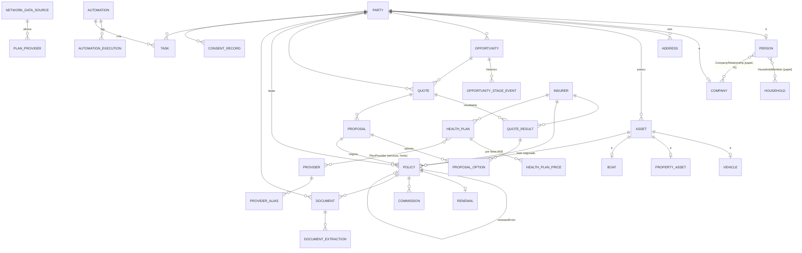

# Modelo de Dados

Fonte da verdade da persistência: [`prisma/schema.prisma`](../prisma/schema.prisma) (design, não conectado à DEMO). Espelha [`src/domain/types.ts`](../src/domain/types.ts). Onde o schema vai além de types.ts, está marcado como **(proposta)**.

## 1. Entidades por grupo

| Grupo | Entidades | Notas |
|---|---|---|
| **Acesso** | Organization, OrgSettings, User, RolePermission, Account, Session, VerificationToken | Tabelas Auth.js; `Session.mfaVerified`; `User.totpSecretEnc` |
| **Partes** | Party, Person, Company, Address, Household, HouseholdMember, CompanyRelationship | Party pattern com PK compartilhada |
| **Ativos** | Asset, Vehicle, PropertyAsset, Boat | Base + tabela por tipo; `details` JSONB para `other` |
| **Produtos/Saúde** | Insurer, HealthPlan, HealthPlanPrice, Provider, ProviderAlias, PlanProvider, NetworkDataSource | Preço por faixa ANS normalizado (proposta); aliases para dedupe |
| **CRM** | Opportunity, OpportunityStageEvent, Interaction | `stageHistory` virou tabela |
| **Cotação** | Quote (request JSONB), QuoteResult | Proveniência por resultado |
| **Proposta** | Proposal, ProposalOption, ProposalEvent | `publicToken` para `/p/[token]` |
| **Apólice/Renovação** | Policy, PolicyBeneficiary, Renewal | Cadeia de renovação `renewedFromId` 1:1 |
| **Operação** | Document, DocumentExtraction, Task | Extração separada do documento (várias tentativas/parsers) |
| **Financeiro** | Commission, CommissionStatement, CommissionStatementLine | Extrato importado para conciliação (proposta) |
| **Automação** | Automation, AutomationExecution | `idempotencyKey` única por automação |
| **Auditoria** | AuditLog, FieldProvenance, EntityHistory, AiInteraction | audit append-only |
| **LGPD** | ConsentRecord, DataSubjectRequest | (proposta) |
| **Integrações** | Integration, IntegrationCredential, IntegrationRun, ImportJob, ImportRow, MessageLog | Segredos fora do banco (`secretRef`) |

## 2. Diagrama ER (núcleo)



## 3. Decisões de modelagem

### 3.1 Party pattern (Person/Company + PartyRef)
`parties` é o supertipo; `persons.id` e `companies.id` **são** o `parties.id` (PK compartilhada). Tudo que referencia "o cliente" (apólice, cotação, proposta, documento, tarefa, interação, consentimento) aponta para `party_id` → **FK real, sem associação polimórfica**. O `PartyRef { type, id }` de types.ts é exatamente `(parties.type, parties.id)`.

### 3.2 Família e vínculos empresariais como N:N
`household_members (household_id, person_id, relation)` e `company_relationships (company_id, person_id, role, share)`. Uma pessoa pode estar em mais de uma família (filho de pais separados) e ter vários papéis em várias empresas.

### 3.3 Ativos: base + tabela por tipo (escolhido) × JSONB
- **Escolha:** `assets` (base, dono, tipo) + `vehicles`, `property_assets`, `boats` 1:1. Tipos raros (`other`, futuros) usam `assets.details` JSONB.
- **Justificativa:** veículos precisam de índices e consultas por **placa**, **código FIPE**, condutor (FK) e imóveis de FK para endereço/geo — isso é ruim em JSONB. Tipos sem consultas estruturadas não justificam tabela própria.

### 3.4 Dados específicos por ramo em JSONB tipado
`quotes.request`, `policies.line_data`, `quote_results.coverages`: JSONB validado por **zod no módulo do ramo** (`requestSchemaVersion` permite evoluir). O core nunca interpreta esses campos; cada módulo os lê/escreve. Campos que viram filtro frequente são promovidos a colunas.

### 3.5 Proveniência
- Colunas em entidades críticas (Person, Company, Asset, Policy): `source` (`manual | importacao | document-ai | proposta | integracao | automacao | demo`), `source_at`, `source_by`, `source_confidence` (+ `source_document_id` em Policy).
- `field_provenance` para granularidade por campo (ex.: vigência veio do documento X, confiança 0,97, confirmada por Y).
- `quote_results` guarda `source_adapter`, `source_method`, `received_at`, `source_reference` e o payload bruto no storage.
- `network_data_sources` dá validade e confiança à rede credenciada.

### 3.6 Soft delete e histórico
`deleted_at` em partes, ativos, oportunidades, apólices, documentos. `entity_history` guarda snapshot antes de cada update (trigger). Eliminação LGPD = anonimização/remoção física após prazos (ver SECURITY_LGPD), não apenas soft delete.

### 3.7 Auditoria append-only
`audit_log` sem UPDATE/DELETE para a role da aplicação (`REVOKE` na migração). Mudanças registram `changes` com campos sensíveis mascarados.

### 3.8 Multi-tenant-ready
Toda tabela de negócio tem `org_id`; unicidades são compostas (`(org_id, cpf_hash)`, `(org_id, cnpj)`). FK para `organizations` e **RLS** (`org_id = current_setting('app.org_id')`) em migração SQL.

### 3.9 Dinheiro e datas
`Decimal(14,2)` para valores (nunca float); datas de vigência como `date`; timestamps `timestamptz` (padrão Prisma no Postgres é `timestamp(3)` — ajustar com `@db.Timestamptz` na migração final, **a decidir**).

## 4. Índices

| Índice | Tipo | Finalidade |
|---|---|---|
| `persons (org_id, cpf_hash)` | UNIQUE | Um CPF por organização (blind index HMAC) |
| `companies (org_id, cnpj)` | UNIQUE | Um CNPJ por organização |
| `persons.name`, `companies.legal_name/trade_name`, `providers.name`, `provider_aliases.normalized` | GIN `gin_trgm_ops` | Busca fuzzy/⌘K, dedupe |
| `vehicles.plate`, `vehicles.fipe_code` | B-tree | Busca por placa, FIPE |
| `policies (org_id, insurer_id, number)` | UNIQUE | Nº de apólice único por seguradora |
| `policies.number` | GIN trigram | Busca parcial de nº de apólice |
| `policies (org_id, end, status)` | B-tree | "Vencendo nos próximos N dias" |
| `renewals (org_id, due_date, status)`, `tasks (org_id, owner_id, status, due)` | B-tree | Central de Operações |
| `addresses.geom`, `providers.geom` | **GIST** (SQL) | Raio/distância (PostGIS) |
| tsvector em documentos/interações | GIN (SQL) | Busca textual |
| `automation_executions (automation_id, idempotency_key)` | UNIQUE | Idempotência |
| `tasks (org_id, dedupe_key)` | UNIQUE | Sem tarefas duplicadas |
| `documents (org_id, sha256)` | UNIQUE | Upload duplicado |

Migração SQL complementar (fora do Prisma):
```sql
CREATE INDEX addresses_geom_gist ON addresses USING GIST (geom);
CREATE INDEX providers_geom_gist ON providers USING GIST (geom);
-- unaccent imutável para índices de busca
CREATE OR REPLACE FUNCTION f_unaccent(text) RETURNS text
  LANGUAGE sql IMMUTABLE PARALLEL SAFE AS $$ SELECT public.unaccent('public.unaccent', $1) $$;
CREATE INDEX persons_name_unaccent_trgm ON persons USING GIN (f_unaccent(lower(name)) gin_trgm_ops);
REVOKE UPDATE, DELETE ON audit_log FROM app_user;
ALTER TABLE persons ENABLE ROW LEVEL SECURITY; -- + policies por org_id (todas as tabelas de negócio)
```

## 5. LGPD no modelo

| Dado | Tratamento |
|---|---|
| CPF | `cpf_enc` (AES-256-GCM, envelope com KMS) + `cpf_hash` (HMAC-SHA256 com pepper) para unicidade/busca exata + `cpf_last4` para exibição mascarada |
| Chassi | `chassis_enc` |
| Dados de saúde (DPS, doenças declaradas, CIDs) — **sensíveis, art. 11** | `policies.sensitive_enc` (e equivalente em propostas de saúde quando existir); nunca em JSONB aberto, nunca em logs, nunca enviados ao LLM sem necessidade |
| Idade/faixa dos beneficiários na cotação | Necessária para preço; manter idade, não nascimento, no `request` quando possível (minimização) |
| Documentos | Storage privado; `contains_sensitive`; `retention_until` |
| Segredos de integração | Fora do banco (`secret_ref`) ou `value_enc` |
| Consentimento | `consent_records` por finalidade com evidência e revogação |
| Requisições de titular | `data_subject_requests` com prazo |

## 6. Entidades do briefing fundidas/renomeadas

| Briefing | Modelo | Motivo |
|---|---|---|
| Client | Person / Company com `clientStatus` | Cliente é um *estado* de uma parte, não uma entidade; dependentes e sócios são pessoas sem status de cliente (`null`) |
| Lead | Opportunity em `stage = 'lead'` + Person/Company `clientStatus = 'lead'` | Evita duplicar cadastro ao converter; histórico preservado |
| Family | Household + HouseholdMember | Nome neutro; N:N com papel |
| CompanyContact / Partner | CompanyRelationship (`role`) | Um só vínculo com papéis |
| Vehicle / Property | Asset + tabelas por tipo | Polimorfismo com FK reais |
| QuoteRequest | `Quote.request` (JSONB tipado por ramo) | Formato varia por ramo; validado por zod no módulo |
| QuoteOption / InsurerQuote | QuoteResult | Um resultado por seguradora/produto com proveniência |
| Network / Rede | Provider + PlanProvider + NetworkDataSource | Rede é relação plano↔prestador com fonte e validade |
| Hospital | Provider (`type`) | Hospitais, clínicas, laboratórios no mesmo cadastro |
| Integration / IntegrationCredential | Integration + IntegrationCredential + IntegrationRun | Credencial separada (rotação, secret manager); execuções logadas |
| Pipeline / Deal | Opportunity + OpportunityStageEvent | Nome único; histórico em tabela |
| Activity / Note | Interaction | Canal + direção |
| Reminder / Alert | Task (com `origin` automação) | Um mecanismo só |
| Log | AuditLog + AutomationExecution + IntegrationRun + AiInteraction | Logs com propósitos e retenções diferentes |

## 7. Propostas de melhoria ao types.ts

1. `Person.cpf` → no servidor, nunca trafegar CPF completo para listagens; DTO com `cpfMasked` e endpoint de revelação auditado.
2. `HealthPlan.pricesByBand` → `HealthPlanPrice` com vigência (reajustes anuais sem perder histórico de propostas).
3. `Proposal` → `publicToken` separado do `id` (URL pública não deve expor id interno).
4. `Commission.installment` para comissões parceladas.
5. `Renewal` único por apólice (idempotência da automação).
6. `Provider.cnes` como chave forte de dedupe.
7. `Task.dedupeKey` para que automações não criem tarefas repetidas.
